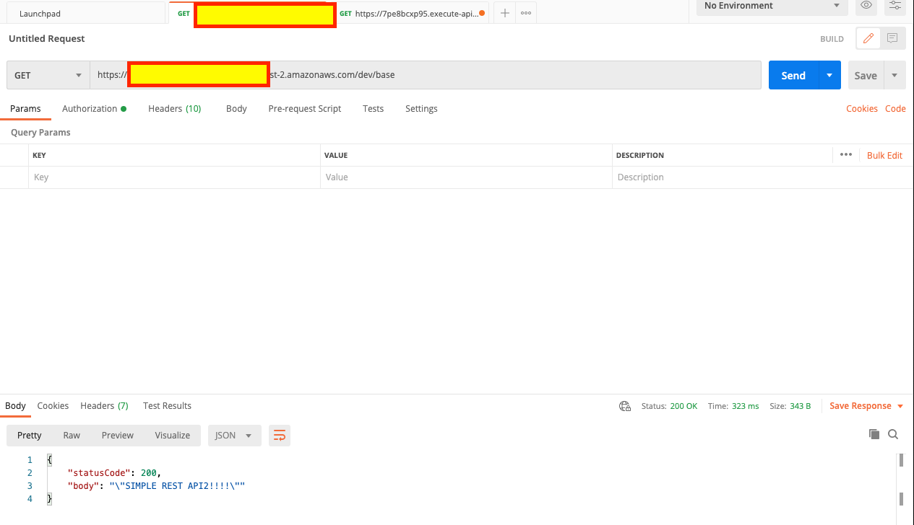
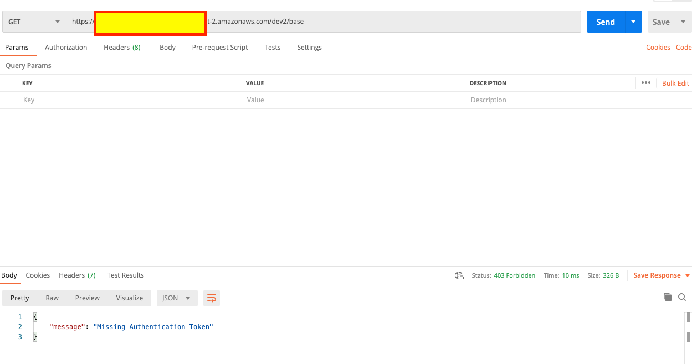
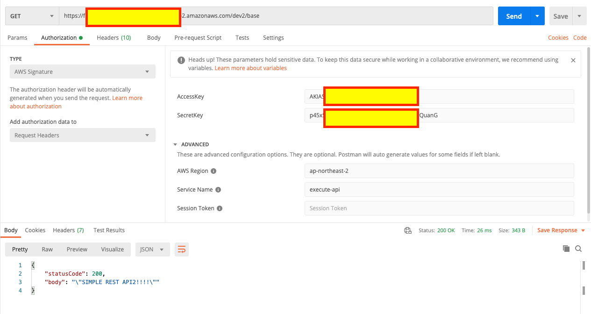

# nodejs lambda + apigw + dynamodb

## Create Lambda

1.  serivces -> lambda -> Create function
2.  Author from scratch
    1.  Function name : SimpleRestAPI
    2.  Runtime : node.js 12.x
    3.  Permissions => Execution role : Create a new role with basic Lambda permissions
    4.  'Create Function' Click
3.  "Select a test event"
4.  "Configure test event"
    1.  "Create new test event"
        1.  Event template : hello-world
        2.  Event name : Test01
    2.  "Create" click
5.  "Test" Click
6.  Check "Execution Result logs"
7.  Grant dynamodb permission

## Create API Gateway

1.  services -> API Gateway -> Create API
2.  Rest API : Build
3.  Create New API
    1.  "New API"
    2.  Settings
        1.  API Name : SimpleRestAPI
        2.  Desc : SimpleRestAPI with dynamodb
        3.  Endpoint Type : Regional
4.  Actions -> Create Resource
    1.  Resource Name : DynamoDB-Users
    2.  Enable API Gateway CORS : Checked
    3.  "Create Resource" Click
5.  Actions -> Enable CORS
6.  Actions -> Create Method -> GET -> ✅ Click
7.  /dynamodb-users - GET - Setup
    1.  Integration type : Lambda Function
    2.  Lambda Region : ap-northeast-2
    3.  Lambda Function : SimpleRestAPI
    4.  Save Click
    5.  "Add Permission to Lambda Function" : OK
8.  /dynamodb-users - GET - Method Execution
    1.  "Test" Click
    2.  "⚡Test" Click
    3.  Check "Response Body"
9.  /dynamodb-users - GET - Method Execution
    1.  Actions -> Deploy API
        1.  Deploy API
            1.  Deployment stage : [New Stage]
            2.  Stage Name : DEV
            3.  "Deploy" Click
10. Stages -> Expand dev
11. Click GET under /dynamodb-users and COPY "Invoke URL"
12. Paste URL into new chrome tab or using postman to check APIGW
13. Check {"statusCode":200,"body":"\"Hello from Lambda!\""}

## Create DynamoDB

1. Services -> DynamoDB -> "Create Table" Click
2. Create DynamoDB table
   1. Table Name : Users
   2. Primary key : id Number
   3. "Create" Click
3. Select Users Table -> Items Tab

```
{
  "city": "seoul",
  "id": 1,
  "mobile": "010-0000-0000",
  "name": "kiwony"
}

{
  "city": "seoul",
  "id": 2,
  "mobile": "010-1111-1111",
  "name": "jane"
}

{
  "city": "tokyo",
  "id": 3,
  "mobile": "010-2222-2222",
  "name": "john"
}
```

## Create nodejs project and install required packages

```
kiwony@kiwonymac.com:/Users/kiwony/temp> mkdir SimpleRestAPI
kiwony@kiwonymac.com:/Users/kiwony/temp/SimpleRestAPI> npm init
kiwony@kiwonymac.com:/Users/kiwony/temp/SimpleRestAPI> npm install aws-sdk
kiwony@kiwonymac.com:/Users/kiwony/temp/SimpleRestAPI> npm install dynamodb-doc
kiwony@kiwonymac.com:/Users/kiwony/temp/SimpleRestAPI> vi index.js
kiwony@kiwonymac.com:/Users/kiwony/temp/SimpleRestAPI> cat index.js
```

```
const doc = require('dynamodb-doc');
const dynamo = new doc.DynamoDB();

exports.handler = (event, context, callback) => {
    const operation = event.httpMethod;
	console.log("Operation" + operation);
    const payload = {
        TableName: 'Users'
    }
    switch (operation) {
        case 'POST':
            dynamo.putItem(payload, callback);
            break;
        case 'PATCH':
            dynamo.updateItem(payload, callback);
            break;
        case 'DELETE':
            dynamo.deleteItem(payload, callback);
            break;
        case 'GET':
            dynamo.scan(payload, (err, data) => {
                callback(null, {
                    'statusCode': 200,
	            	'Version' : '20210102-v1',
                    'headers': {},
                    'body': JSON.stringify(data)
                });
            });
            break;
        default:
            callback(new Error(`Unrecognized operation "${operation}"`));
    }
};

kiwony@kiwonymac.com:/Users/kiwony/temp/SimpleRestAPI> zip -r ../SimpleRestAPI.zip .

kiwony@kiwonymac.com:/Users/kiwony/temp> aws lambda update-function-code --function-name SimpleRestAPI --zip-file fileb://../SimpleRestAPI.zip
{
"FunctionName": "SimpleRestAPI",
"FunctionArn": "arn:aws:lambda:ap-northeast-2:12345678912:function:SimpleRestAPI",
"Runtime": "nodejs12.x",
"Role": "arn:aws:iam::12345678912:role/service-role/SimpleRestAPI-role-bhr5lk50",
"Handler": "index.handler",
"CodeSize": 16544639,
"Description": "",
"Timeout": 3,
"MemorySize": 128,
"LastModified": "2021-01-04T07:30:49.434+0000",
"CodeSha256": "OSfphdM5/XWur+HqiBHAM+/vglVOoLDgzmnCaxmqXjw=",
"Version": "$LATEST",
"TracingConfig": {
"Mode": "PassThrough"
},
"RevisionId": "89df01bd-986e-4f9e-8fe9-ddac4071c08d",
"State": "Active",
"LastUpdateStatus": "Successful"
}

```

## Test Get method

**If the lambda is not able to get data from dynamodb, please check lambda function's permission**

```
kiwony@kiwonymac.com:/Users/kiwony> curl --header "Content-Type: application/json" --request GET --data '{"httpMethod":"GET"}' https://abcdefghi.execute-api.ap-northeast-2.amazonaws.com/dev/dynamodb-users
{"statusCode":200,"Test":"XXX","headers":{},"body":"{\"Items\":[{\"city\":\"tokyo\",\"mobile\":\"010-2222-2222\",\"id\":3,\"name\":\"john\"},{\"city\":\"seoul\",\"mobile\":\"010-1111-1111\",\"id\":2,\"name\":\"jane\"},{\"city\":\"seoul\",\"mobile\":\"010-0000-0000\",\"id\":1,\"name\":\"kiwony\"}],\"Count\":3,\"ScannedCount\":3}"}%
```

## Making API key mandatory to call API

1. services -> API GW -> APIS:SimpleRestAPI -> Resources -> dynamodb-users -> abcdefghiGET -> Method Execution
2. Settings -> API Key Required : true

**TEST without deploy API**

```
kiwony@kiwonymac.com:/Users/kiwony/temp/SimpleRestAPI> curl --header "Content-Type: application/json" --request GET --data '{"httpMethod":"GET"}' https://abcdefghi.execute-api.ap-northeast-2.amazonaws.com/dev/dynamodb-users
{"statusCode":200,"Version":"20210112","headers":{},"body":"{\"Items\":[{\"city\":\"tokyo\",\"mobile\":\"010-2222-2222\",\"id\":3,\"name\":\"john\"},{\"city\":\"seoul\",\"mobile\":\"010-1111-1111\",\"id\":2,\"name\":\"jane\"},{\"city\":\"seoul\",\"mobile\":\"010-0000-0000\",\"id\":1,\"name\":\"kiwony\"}],\"Count\":3,\"ScannedCount\":3}"}%
```

**Test after deploying API without API key configuration**

```
kiwony@kiwonymac.com:/Users/kiwony/temp/SimpleRestAPI> curl --header "Content-Type: application/json" --request GET --data '{"httpMethod":"GET"}' https://abcdefghi.execute-api.ap-northeast-2.amazonaws.com/dev/dynamodb-users
{"message":"Forbidden"}%
```

## Create API Keys and assign into API

1. services -> API GW -> API Keys
2. Actions -> "Create API Key"
   1. Name : SimpleRestAPIKey
   2. API key : Auto Generate
3. Save
4. API key : SHOW click

## Create Usage Plans

1. services -> API GW -> Usage Plans -> "Create" Click
   1. Name : SimpleRestAPIKEY
   2. Rate : 10
   3. Burst : 20
   4. Quota : 1000
2. Next - Associated API Stages
   1. Add API Stage
      1. API : SimpleRestAPI
      2. Stage : dev
      3. ✅ Click
3. Next
   1. Usage Plan API Keys
      1. "Add API Key to Usag Plan"
         1. Name : SimpleRestAPIKey
         2. ✅ Click
4. Done

## API Test using API Key(x-api-key)

```
kiwony@kiwonymac.com:/Users/kiwony/temp/SimpleRestAPI> curl --header "Content-Type: application/json" -H 'X-Api-Key:UDu3ZyYzZ767NN9ER1uLq12345678'  --request GET --data '{"httpMethod":"GET"}' https://abcdefghi.execute-api.ap-northeast-2.amazonaws.com/dev/dynamodb-users
{"statusCode":200,"Version":"20210112","headers":{},"body":"{\"Items\":[{\"city\":\"tokyo\",\"mobile\":\"010-2222-2222\",\"id\":3,\"name\":\"john\"},{\"city\":\"seoul\",\"mobile\":\"010-1111-1111\",\"id\":2,\"name\":\"jane\"},{\"city\":\"seoul\",\"mobile\":\"010-0000-0000\",\"id\":1,\"name\":\"kiwony\"}],\"Count\":3,\"ScannedCount\":3}"}%
```

## API Test using AWS_IAM

1. Create Lambda Function - SimpleRestAPI2
2. Create new API Gateway - SimpleRestAPI2
   1. Create Resources : /base
      1. Create Method : GET
3. Connect Lambda with API Gateway
4. Deploy API into Stage
5. Test using Postman - Working

<kbd>  </kbd>

6. /base - GET - Method Execution

   1. Method Request
      1. Authorization : AWS_IAM

7. services -> API GW -> /base resource
8. Deploy API into Stage2
9. Test using Postman on Stage2 - Failed

<kbd>  </kbd>

10. Create IAM User who has permission to invoke API in APIGW
11. Create New IAM Policy - SimpleRestAPI2-Policy

```
{
    "Version": "2012-10-17",
    "Statement": [
        {
            "Effect": "Allow",
            "Action": [
                "execute-api:Invoke",
                "execute-api:ManageConnections"
            ],
            "Resource": "arn:aws:execute-api:ap-northeast-2:165277451234:fb4abcdeo2"
        }
    ]
}
```

12. Create New IAM User(User01) who has policy -SimpleRestAPI2-Policy and check access / secret key

13. Test using Postman on Stage2 - Working

<kbd>  </kbd>
